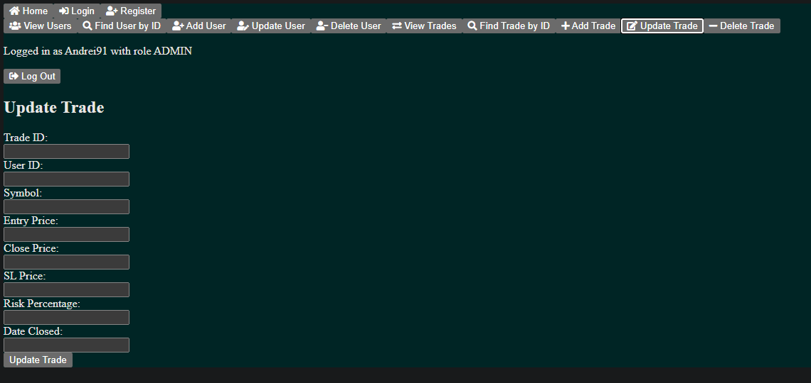

# Trade Lens - the Future of Trade Analytics

Welcome to the Trade Lens repository! This web application is designed to showcase backend API endpoint creation, security features such as authentication, and frontend aspects like page routing.

## Table of Contents
1. [Introduction](#introduction)
2. [Features](#features)
3. [Architecture](#architecture)
4. [Frontend - Angular 14](#frontend---angular-14)
5. [Backend - Java 17 with Spring Boot](#backend---java-17-with-spring-boot)
6. [Database Schema](#database-schema)
7. [Security](#security)
8. [Setup and Installation](#setup-and-installation)
9. [Usage](#usage)
10. [Contributing](#contributing)
11. [License](#license)

## Introduction
Trade Lens is a web application that offers a comprehensive view of trade analytics. It features user and trade management with a secure login system. The slogan of the app, visible on the main page logo, is "Trade Lens - the Future of Trade Analytics".

## Features
- **User Management:** CRUD operations for users.
- **Trade Management:** CRUD operations for trades.
- **Authentication:** JWT-based authentication with role-based access control (USER and ADMIN).
- **Frontend:** Developed using Angular 14, with intuitive page routing and a responsive design.
- **Security:** Password hashing and secure API endpoints.

## Architecture
Trade Lens is divided into two main parts:
1. **Frontend:** Built with Angular 14.
2. **Backend:** Powered by Java 17 and the Spring Boot framework.

## Frontend - Angular 14
The frontend of Trade Lens is developed using Angular 14. It includes:
- **Page Routing:** Easy navigation between different views.
- **User Interface:** Forms for login, registration, and managing trades.
- **HTTP Interceptors:** For handling JWT tokens and making authenticated requests.


## Backend - Java 17 with Spring Boot
The backend is built with Java 17 and Spring Boot. It handles all API requests, user authentication, and data management.


## Database Schema
The database consists of two main entities: `User` and `Trade`, with a one-to-many relationship.
- **User:** Represents an application user with fields for ID, username, password (hashed), and roles.
- **Trade:** Represents a trade entry with fields for ID, trade details, and a foreign key to the user.


## Security
- **JWT Authentication:** Ensures that API endpoints are accessible only to authenticated users.
- **Role-Based Access Control:** Differentiates permissions between USER and ADMIN roles.
- **Password Hashing:** User passwords are securely hashed in the database.

## Setup and Installation

### Prerequisites
- Node.js and npm
- Angular CLI
- Java 17
- Maven
- MySQL or any compatible database

### Frontend Setup
1. Navigate to the frontend directory:
    ```sh
    cd frontend
    ```
2. Install dependencies:
    ```sh
    npm install
    ```
3. Start the Angular development server:
    ```sh
    ng serve
    ```

### Backend Setup
1. Navigate to the backend directory:
    ```sh
    cd backend
    ```
2. Install dependencies and build the project:
    ```sh
    mvn clean install
    ```
3. Configure the database connection in `application.properties`:
    ```properties
    spring.datasource.url=jdbc:mysql://localhost:3306/tradelens
    spring.datasource.username=root
    spring.datasource.password=yourpassword
    spring.jpa.hibernate.ddl-auto=update
    ```
4. Run the Spring Boot application:
    ```sh
    mvn spring-boot:run
    ```

## Usage
1. Register a new user via the registration page.

    
    
2. Log in with your credentials to receive a JWT token.

    
    
3. Use the token to access protected API endpoints and manage trades.

    
    
    
    
    
    
    
    
    
    
    

## Contributing
Contributions are welcome! Please fork the repository and create a pull request with your changes.

## License
This project is licensed under the MIT License.
